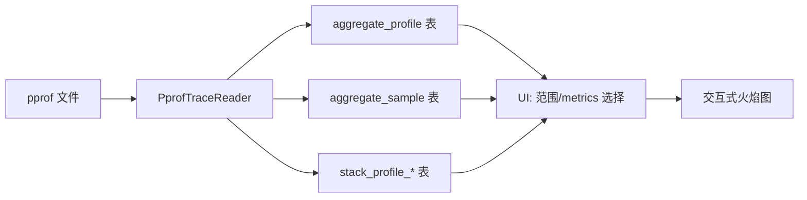

# Perfetto 中的 pprof 支持

_**状态：** 已完成 **·** lalitm **·** 2025-09-30_

## 目标

添加将 pprof 文件导入 Perfetto Trace Processor 并在 Perfetto UI 中使用火焰图可视化它们的支持。这能够在 Perfetto 生态系统中分析来自 Go、C++ 和其他生成 pprof 格式的工具的 CPU/heap 配置文件。

## 概述

此功能扩展了 Perfetto 的 trace 分析能力，包括非基于时间的聚合 profile 数据。与现有的、与基于 Timeline 的 traces 集成的分析支持不同，pprof 数据表示独立的聚合样本，独立于时间。



实现建立在现有的 Perfetto 基础设施之上：
- **数据库层**： 使用新的聚合表扩展现有的 `stack_profile_*` 表
- **导入管道**： 遵循已建立的 `TraceType` + `TraceReader` 模式
- **UI 层**： 利用现有的火焰图可视化组件

### 要求

**零设置分析：** 可以通过单个命令或拖放分析 pprof 文件。

**完整格式支持：** 支持来自任何 pprof 兼容工具的 gzip 和未压缩的 pprof protobuf 文件。

**每个文件的多个 metrics：** 处理单个可视化中包含多个值类型（例如，CPU 样本 + 分配计数）的 pprof 文件。

**交互式火焰图：** 提供完整的交互性，包括缩放、搜索和源位置归因（在可用的情况下）。

**无 Timeline 混淆：** 保持 pprof 数据完全独立于基于时间的 trace 分析，以避免用户混淆。

## 详细设计

### 文件格式支持

实现支持 [Google 的 pprof 工具](https://github.com/google/pprof/blob/main/proto/profile.proto) 定义的标准 pprof 格式：

**Gzip 格式：** 由大多数分析工具典型生成的使用 gzip 压缩的文件。

**原始 protobuf:** 用于开发和测试的未压缩 protobuf 文件。

**配置文件结构：** 完全支持 Profile protobuf 消息，包括：
- 用于重复数据删除的字符串表
- 带有位置层次结构的样本数据
- 函数和映射元数据
- 多个值类型(CPU 样本、分配等)

### 导入架构

#### 文件检测

导入管道通过两阶段过程自动检测 pprof 文件：

1. **Gzip 检测：** 通过魔术字节（`1f 8b`）识别 gzip 文件
2. **Protobuf 验证：** 解压后，通过检查具有 `sample_type` 字段的 Profile 消息来验证 pprof 结构

#### PprofTraceReader

```cpp
class PprofTraceReader : public ChunkedTraceReader {
 public:
 explicit PprofTraceReader(TraceProcessorContext* context);

 base::Status Parse(TraceBlobView blob) override;
 base::Status NotifyEndOfFile() override;

 private:
 base::Status ParseProfile();

 TraceProcessorContext* context_;
 std::vector<uint8_t> buffer_;
};
```

阅读器将 pprof 数据累积到内部缓冲区，并在 EOF 通知时解析完整的 protobuf 消息。

### 数据库模式

#### 新表

实现引入了两个与现有堆栈分析基础设施集成的新表：

```sql
-- 来自 pprof 文件的每个分析 metrics 的元数据
CREATE TABLE aggregate_profile (
 id INTEGER PRIMARY KEY,
 scope TEXT, -- 文件标识符(例如 "cpu.pprof")
 name TEXT, -- 显示名称(例如 "pprof cpu")
 sample_type_type TEXT, -- pprof ValueType.type(例如 "cpu")
 sample_type_unit TEXT -- pprof ValueType.unit(例如 "nanoseconds")
);

-- 按调用站点聚合的样本值
CREATE TABLE aggregate_sample (
 id INTEGER PRIMARY KEY,
 aggregate_profile_id INTEGER, -- FK 到 aggregate_profile
 callsite_id INTEGER, -- FK 到 stack_profile_callsite
 value REAL -- 样本计数/值
);
```

#### 与现有基础设施的集成

- **stack_profile_frame:** 存储函数名和源文件信息
- **stack_profile_callsite:** 维护从根到叶的调用堆栈层次结构
- **stack_profile_mapping:** 包含二进制/库映射信息

每个 pprof 位置变成一个帧，调用站点表示从根到叶的完整调用链，样本在每个调用站点聚合值。

### 数据处理管道

#### 步骤 1：字符串表解析

所有 pprof 文件都使用字符串表进行重复数据删除。导入器从 protobuf `string_table` 字段构建字符串向量。

#### 步骤 2：映射和函数创建

对于每个 pprof `Mapping` 和 `Function`:
- 提取二进制名称、构建 ID 和内存范围
- 在 `stack_profile_mapping` 中创建条目并填充帧元数据
- 构建用于位置解析的查找表

#### 步骤 3：位置处理

每个 pprof `Location` 代表带有可选调试信息的程序计数器：
- 将地址映射到现有的或虚拟内存映射
- 从关联的行信息中提取函数名
- 创建带有相对 PC 的 `stack_profile_frame` 条目

#### 步骤 4：样本处理

对于每个 pprof `Sample`:
- 从位置链构建完整的调用站点层次结构(反转 pprof 叶优先顺序)
- 为样本中的每个值类型创建聚合条目
- 通过 `aggregate_sample` 表将样本链接到调用站点

```
Pprof 样本 → 位置 ID [3,2,1] (叶优先)
 ↓
Perfetto 调用站点层次结构: 1 → 2 → 3 (根到叶)
 ↓
多个 aggregate_sample 条目(每个值类型一个)
```

### UI 实现

#### PprofPage 组件

UI 提供从主导航访问的 pprof 分析专用页面。页面自动发现可用数据并提供交互式控件。

#### 动态数据发现

加载时，UI 查询数据库以发现：

1. **可用范围**(通常每个导入的 pprof 文件一个)
2. **每个范围内的可用 metrics**(CPU、分配等)
3. **选定范围/metrics 组合的样本数据**

```typescript
// 发现可用的 pprof 数据
const scopesResult = await trace.engine.query(`
 SELECT DISTINCT scope FROM __intrinsic_aggregate_profile ORDER BY scope
`);

// 加载选定范围的 metrics
const metricsResult = await trace.engine.query(`
 SELECT sample_type_type, sample_type_unit
 FROM __intrinsic_aggregate_profile
 WHERE scope = '${selectedScope}'
`);
```

#### 火焰图集成

实现使用动态生成的 metrics 重用 Perfetto 的现有 `QueryFlamegraph` 组件：

```typescript
const flamegraphMetrics = metricsFromTableOrSubquery(
 `
 WITH metrics AS MATERIALIZED (
 SELECT
 callsite_id,
 sum(sample.value) AS self_value
 FROM __intrinsic_aggregate_sample sample
 JOIN __intrinsic_aggregate_profile profile
 ON sample.aggregate_profile_id = profile.id
 WHERE profile.scope = '${scope}'
 AND profile.sample_type_type = '${metric}'
 GROUP BY callsite_id
 )
 SELECT
 c.id,
 c.parent_id as parentId,
 c.name,
 c.mapping_name,
 coalesce(m.self_value, 0) AS self_value
 FROM _callstacks_for_stack_profile_samples!(metrics) AS c
 LEFT JOIN metrics AS m USING (callsite_id)
 `,
 [{ name: 'Pprof Samples', unit: unit, columnName: 'self_value' }],
 'include perfetto module callstacks.stack_profile'
);
```

此查询利用现有的 `_callstacks_for_stack_profile_samples!` 表函数来构建完整的火焰图层次结构，同时聚合 pprof 样本值。

### 使用

#### 命令行分析

```bash
# 直接分析 pprof 文件
$ trace_processor_shell profile.pprof

# 查询可用 metrics
> SELECT scope, sample_type_type, sample_type_unit
 FROM __intrinsic_aggregate_profile;

# 检查样本数据
> SELECT COUNT(*) FROM __intrinsic_aggregate_sample
 WHERE aggregate_profile_id = 1;
```

#### Web UI 分析

1. **文件加载：** 将 pprof 文件拖放到 Perfetto UI 中或使用文件选择器
2. **自动检测：** Perfetto 识别 pprof 格式并导入数据
3. **导航：** 从主导航转到"Pprof"页面
4. **交互式分析：** 选择范围/metrics 并探索火焰图

#### 多 metrics 文件

对于包含多个值类型（例如，CPU 样本 + heap 分配）的 pprof 文件：

1. **单个导入：** 来自一个文件的所有 metrics 在同一范围下一起导入
2. **metrics 切换：** UI 下拉菜单允许立即在 metrics 之间切换
3. **独立分析：** 每个 metrics 显示为单独的火焰图

## 设计原则

### 集成而非替换

不构建独立的 pprof 查看器，此功能将 pprof 分析集成到 Perfetto 的现有基础设施中。这提供：

**统一工具：** 用户可以使用相同的 UI 和 SQL 接口分析 pprof 数据和其他 trace 格式。

**利用基础设施：** 重用现有的火焰图渲染、调用堆栈处理和数据库优化。

**一致的 UX:** 为已经使用该平台的用户提供熟悉的 Perfetto 界面。

### 关注点分离

**Timeline 独立性：** pprof 数据表示没有时间维度的聚合样本，与基于时间的 trace 分析完全分离。

**静态导入模型：** pprof 文件导入一次并存储在只读表中，避免复杂的重新聚合逻辑。

**格式特定处理：** 专用处理程序处理 pprof 特定概念，同时映射到 Perfetto 的一般分析抽象。

### 最小开销

**未使用时零成本：** 当不使用 pprof 功能时，对现有 Perfetto 功能没有影响。

**高效存储：** 样本值以聚合形式存储，避免冗余的每样本开销。

**查询优化：** 利用现有的数据库索引和表函数以获得最佳性能。
