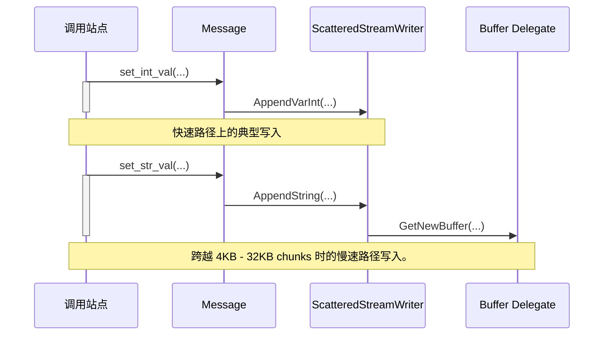

# Protozero 设计文档

Protozero 是专为 Perfetto 跟踪用例量身定制的零拷贝、零分配、零系统调用的 protobuf 序列化库。

## 动机

Protozero 专为所有 Perfetto tracing 路径中使用的 proto 序列化进行了设计和优化。反序列化仅在项目后期引入，主要由离线工具使用（例如，[TraceProcessor](/docs/analysis/trace-processor.md）。_零拷贝、零分配、零系统调用_ 语句仅适用于序列化代码。

Perfetto 在 tracing 快速路径中广泛使用 protobuf。Perfetto 中的每个 trace 事件都是一个 proto(请参阅 [TracePacket](/docs/reference/trace-packet-proto.autogen) 参考)。这允许事件具有强类型，并使团队更容易使用一种普遍理解的语言来保持向后兼容性。

跟踪快速路径必须具有非常低的开销，因为检测点散布在 Android 和 Chrome 等项目的代码库中，并且对性能至关重要。

此处的开销不仅定义为执行检测点所需的 CPU 时间（或退休的指令）。tracing 系统中的一个主要开销源是检测点的工作集，具体来说是额外的 I 缓存和 D 缓存未命中，这会减慢 tracing 检测点之后的非 tracing 代码的速度。

Protozero 与规范 C++ protobuf 库如 [libprotobuf](https://github.com/google/protobuf) 的主要设计区别在于：

- 将序列化和反序列化视为由不同代码服务的不同用例。

- 优化序列化路径的二进制大小和工作集大小。

- 忽略 protobuf 的大部分错误检查和长尾功能（repeated vs optional、完整类型检查）。

- Protozero 不设计为通用的 protobuf 反/序列化，并且大量自定义以保持跟踪写入代码最小，并允许编译器查看架构层。

- Protozero 生成的代码必须是隔离的。当构建合并的 [Tracing SDK](/docs/instrumentation/tracing-sdk.md) 时，所有 perfetto 跟踪源必须不依赖于 C+- 标准库和 C 库以外的任何其他库。

## 使用

在构建系统级别，Protozero 与传统的 libprotobuf 库非常相似。
Protozero `.proto -> .pbzero.{cc,h}` 编译器基于 libprotobuf 解析器和编译器基础设施。Protozero 是一个 `protoc` 编译器插件。

Protozero 在构建时对 libprotobuf 有依赖（插件依赖于 libprotobuf 的解析器和编译器）。但是，由它生成的 `.pbzero.{cc,h}` 代码对 libprotobuf 没有运行时依赖（甚至没有仅头文件的依赖）。

为了从 proto 生成 Protozero 存根，你需要：

1. 构建 Protozero 编译器插件，位于 [src/protozero/protoc_plugin/](/src/protozero/protoc_plugin/)。
 ```bash
 tools/ninja -C out/default protozero_plugin protoc
 ```

2. 调用 libprotobuf `protoc` 编译器传递 `protozero_plugin`:
 ```bash
 out/default/protoc \
 --plugin=protoc-gen-plugin=out/default/protozero_plugin \
 --plugin_out=wrapper_namespace=pbzero:/tmp/ \
 test_msg.proto
 ```
 这会生成 `/tmp/test_msg.pbzero.{cc,h}`。
 
 注意:.cc 文件始终为空。Protozero 生成的代码仅是头文件。发出 .cc 文件仅因为某些构建系统的规则假设 protobuf 代码生成生成 .cc 和 .h 文件。

## Proto 序列化

理解 Protozero 设计原则的最快方法是从一个小示例开始，并比较 libprotobuf 和 Protozero 之间生成的代码。

```protobuf
syntax = "proto2";

message TestMsg {
 optional string str_val = 1;
 optional int32 int_val = 2;
 repeated TestMsg nested = 3;
}
```

#### libprotobuf 方法

libprotobuf 方法是生成一个 C++ 类，它为每个 proto 字段有一个成员，并具有专用的序列化和反序列化方法。

```bash
out/default/protoc --cpp_out=. test_msg.proto
```

生成 test_msg.pb.{cc,h}。经过许多简化，它看起来如下：

```c++
// 此类由标准 protoc 编译器在 .pb.h 源中生成。
class TestMsg : public protobuf::MessageLite {
 private:
 int32 int_val_;
 ArenaStringPtr str_val_;
 RepeatedPtrField<TestMsg> nested_; // 实际上是 vector<TestMsg>

 public:
 const std::string& str_val() const;
 void set_str_val(const std::string& value);

 bool has_int_val() const;
 int32_t int_val() const;
 void set_int_val(int32_t value);

 ::TestMsg* add_nested();
 ::TestMsg* mutable_nested(int index);
 const TestMsg& nested(int index);

 std::string SerializeAsString();
 bool ParseFromString(const std::string&);
}
```

这些存根的主要特征是：

- 从 .proto 消息生成的代码可以在代码库中用作通用对象，而无需使用 `SerializeAs*()` 或 `ParseFrom*()` 方法（尽管轶事证据表明大多数项目仅在反/序列化端点使用这些 proto 生成的类）。

- 序列化 proto 的端到端旅程涉及两个步骤：
 1. 设置生成类的各个 int / string / vector 字段。
 2. 对这些字段进行序列化传递。

 依次，这会对生成的代码产生副作用。字符串和向量的 STL 复制/赋值运算符是非平凡的，因为，例如，它们需要处理动态内存调整大小。

#### Protozero 方法

```c++
// 此类由 .pbzero.h 源中的 Protozero 插件生成。
class TestMsg : public protozero::Message {
 public:
 void set_str_val(const std::string& value) {
 AppendBytes(/*field_id=*/1, value.data(), value.size());
 }
 void set_str_val(const char* data, size_t size) {
 AppendBytes(/*field_id=*/1, data, size);
 }
 void set_int_val(int32_t value) {
 AppendVarInt(/*field_id=*/2, value);
 }
 TestMsg* add_nested() {
 return BeginNestedMessage<TestMsg>(/*field_id=*/3);
 }
}
```

Protozero 生成的存根是仅追加的。随着调用 `set_*`、`add_*` 方法，传递的参数直接序列化到目标缓冲区中。这引入了一些限制：

- 不可能读回：这些类不能用作 C+- 结构的替代品。

- 不执行错误检查：如果调用者意外调用两次 `set_*()` 方法，没有什么可以阻止在序列化的 proto 中两次发出非重复字段。尽管如此，仍在编译时执行基本类型检查。

- 嵌套字段必须以堆栈方式填充，并且不能交错写入。一旦开始嵌套消息，必须在返回设置父消息的字段之前设置其字段。事实证明，对于大多数跟踪用例，这不会成为问题。

这有许多优点：

- Protozero 生成的类在它们派生的基类（`protozero::Message`）之上不添加任何额外状态。它们只定义调用基类序列化方法的内联 setter 方法。编译器可以看到这些方法的所有内联扩展。

- 因此，Protozero 的二进制成本独立于定义的 protobuf 消息的数量及其字段，并且仅取决于 `set_*`/`add_*` 调用的数量。这（即未使用的 proto 消息和字段的二进制成本）在 libprotobuf 中轶事地是一个大问题。

- 序列化方法不涉及任何复制或动态分配。内联扩展直接调用 `protozero::Message` 的相应 `AppendVarInt()` / `AppendString()` 方法。

- 这允许直接将 trace 事件序列化到 [tracing 共享内存缓冲区](/docs/concepts/buffers.md)，即使它们不是连续的。

### 分散缓冲区写入

Protozero 设计的一个关键部分是支持在非全局连续的连续内存区域序列上直接序列化。

这是通过将所有生成类的基类 `protozero::Message` 与 `protozero::ScatteredStreamWriter` 分离来实现的。它解决的问题如下：Protozero 基于直接序列化到共享内存缓冲区 chunks。这些 chunks 在大多数情况下为 4KB - 32KB。同时，调用者将尝试写入单个消息的数据量没有限制，trace 事件可能高达 256 MiB。


#### 快速路径

在所有时间，底层的 `ScatteredStreamWriter` 知道当前缓冲区的边界。所有写操作都进行边界检查，并在跨越缓冲区边界时命中慢速路径。

大多数写操作可以在当前缓冲区边界内完成。在这种情况下，`set_*` 操作的成本本质上是 `memcpy()`，并带有 protobuf 前缀和长度限定字段的 var-int 编码的额外开销。

#### 慢速路径

跨越边界时，慢速路径请求 `ScatteredStreamWriter::Delegate` 提供新缓冲区。`GetNewBuffer()` 的实现由客户端决定。在跟踪用例中，该调用将从跟踪共享内存缓冲区获取新的线程本地 chunk。

也可以实现其他基于堆的实现。例如，Protozero 源提供了一个辅助类 `HeapBuffered<TestMsg>`，主要用于测试(请参阅 [scattered_heap_buffer.h](/include/perfetto/protozero/scattered_heap_buffer.h))，它在跨越当前缓冲区的边界时分配新的堆缓冲区。

考虑以下示例：

```c++
TestMsg outer_msg;
for (int i = 0; i < 1000; i++) {
 TestMsg* nested = outer_msg.add_nested();
 nested->set_int_val(42);
}
```

在某个时候，其中一个 `set_int_val()` 调用将命中慢速路径并获取新缓冲区。整体想法是拥有一个大多数时候极其轻量级的序列化机制，并且在缓冲区边界需要一些额外的函数调用，以便它们的成本在所有 trace 事件上摊销。

在整个 Perfetto tracing 用例的上下文中，慢速路径涉及获取进程本地互斥锁并在共享内存缓冲区中找到下一个可用 chunk。因此，只要写入在线程本地 chunk 内发生，写入就是无锁的，并且每 4KB-32KB（取决于 tracing 配置）获取一个新 chunk 需要一次临界区。

假设两个线程同时跨越 chunk 边界并调用 `GetNewBuffer()` 的可能性极低，因此临界区在大多数情况下是无竞争的。



### 延迟修补

protobuf 二进制编码中的嵌套消息以其 varint 编码的大小为前缀。

考虑以下内容：

```c++
TestMsg* nested = outer_msg.add_nested();
nested->set_int_val(42);
nested->set_str_val("foo");
```

使用 libprotobuf 的此 protobuf 消息的规范编码将是：

```bash
1a 07 0a 03 66 6f 6f 10 2a
^-+-^ ^-----+------^ ^-+-^
 | | |
 | | +--> 字段 ID: 2 [int_val], value = 42。
 | |
 | +------> 字段 ID: 1 [str_val], len = 3, value = "foo" (66 6f 6f)。
 |
 +------> 字段 ID: 3 [nested], length: 7 # !!!
```

此序列中的第二个字节（07）对于直接编码是有问题的。在调用 `outer_msg.add_nested()` 时，我们无法预先知道嵌套消息的总体大小（在这种情况下，5 + 2 = 7）。

我们在 Protozero 中解决此问题的方法是为每个嵌套消息的 _大小_ 保留四个字节，并在消息完成时（或当我们尝试设置父消息之一的字段时）回填它们。我们通过使用冗余 varint 编码对消息的大小进行编码来做到这一点，在这种情况下：`87 80 80 00` 而不是 `07`。

在 C++ 级别，`protozero::Message` 类保存指向其 `size` 字段的指针，该指针通常指向消息的开头，其中保留了四个字节，并在 `Message::Finalize()` 传递中回填它。

这对于整个消息位于一个连续缓冲区中的情况工作正常，但在消息可能跨越缓冲区边界时会带来进一步的挑战：消息可能很大 MB。从整体跟踪角度来看，保存消息开始的共享内存缓冲区 chunk 可能已经消失（即已提交到中央服务缓冲区），当我们到达结束时。

为了支持此用例，在跟踪代码级别（在 Protozero 之外），当消息跨越缓冲区边界时，其 `size` 字段被重定向到临时修补缓冲区(请参阅 [patch_list.h](/src/tracing/core/patch_list.h))。此修补缓冲区随后带外发送，通过下一个提交 IPC 进行(请参阅 [跟踪协议 ABI](/docs/design-docs/api-and-abi.md#tracing-protocol-abi))

### 性能特征

NOTE: 有关基准测试的完整代码，请参阅 `/src/protozero/test/protozero_benchmark.cc`

我们考虑两种场景：写入简单事件和嵌套事件

#### 简单事件

包含用 4 个整数（2 x 32 位、2 x 64 位）和 32 字节字符串填充平面 proto 消息，如下所示：

```c++
void FillMessage_Simple(T* msg) {
 msg->set_field_int32(...);
 msg->set_field_uint32(...);
 msg->set_field_int64(...);
 msg->set_field_uint64(...);
 msg->set_field_string(...);
}
```

#### 嵌套事件

包含类似的递归嵌套 3 层深的消息：

```c++
void FillMessage_Nested(T* msg, int depth = 0) {
 FillMessage_Simple(msg);
 if (depth < 3) {
 auto* child = msg->add_field_nested();
 FillMessage_Nested(child, depth + 1);
 }
}
```

#### 比较条款

我们比较相同消息类型的 Protozero、libprotobuf 和光速序列化器的性能。

光速序列化器是一个非常简单的 C++ 类，只是将数据附加到线性缓冲区中，对所有类型的假设都是有利的。它不使用任何二进制稳定编码，不执行边界检查，所有写入都是 64 位对齐的，它不处理任何线程安全。

```c++
struct SOLMsg {
 template <typename T>
 void Append(T x) {
 // memcpy 将被编译器省略，后者只发出一条 64 位对齐 mov 指令。
 memcpy(reinterpret_cast<void*>(ptr_), &x, sizeof(x));
 ptr_ += sizeof(x);
 }

 void set_field_int32(int32_t x) { Append(x); }
 void set_field_uint32(uint32_t x) { Append(x); }
 void set_field_int64(int64_t x) { Append(x); }
 void set_field_uint64(uint64_t x) { Append(x); }
 void set_field_string(const char* str) { ptr_ = strcpy(ptr_, str); }

 alignas(uint64_t) char storage_[sizeof(g_fake_input_simple) + 8];
 char* ptr_ = &storage_[0];
};
```

光速序列化器作为参考，如果参数封送和边界检查是零成本，_序列化器可能有多快_。

#### 基准测试结果

##### Google Pixel 3 - aarch64

```bash
$ cat out/droid_arm64/args.gn
target_os = "android"
is_clang = true
is_debug = false
target_cpu = "arm64"

$ ninja -C out/droid_arm64/ perfetto_benchmarks && \
 adb push --sync out/droid_arm64/perfetto_benchmarks /data/local/tmp/perfetto_benchmarks && \
 adb shell '/data/local/tmp/perfetto_benchmarks --benchmark_filter=BM_Proto*'

------------------------------------------------------------------------
Benchmark Time CPU Iterations
------------------------------------------------------------------------
BM_Protozero_Simple_Libprotobuf 402 ns 398 ns 1732807
BM_Protozero_Simple_Protozero 242 ns 239 ns 2929528
BM_Protozero_Simple_SpeedOfLight 118 ns 117 ns 6101381
BM_Protozero_Nested_Libprotobuf 1810 ns 1800 ns 390468
BM_Protozero_Nested_Protozero 780 ns 773 ns 901369
BM_Protozero_Nested_SpeedOfLight 138 ns 136 ns 5147958
```

##### HP Z920 工作站（Intel Xeon E5-2690 v4）运行 Linux

```bash

$ cat out/linux_clang_release/args.gn
is_clang = true
is_debug = false

$ ninja -C out/linux_clang_release/ perfetto_benchmarks && \
 out/linux_clang_release/perfetto_benchmarks --benchmark_filter=BM_Proto*

------------------------------------------------------------------------
Benchmark Time CPU Iterations
------------------------------------------------------------------------
BM_Protozero_Simple_Libprotobuf 428 ns 428 ns 1624801
BM_Protozero_Simple_Protozero 261 ns 261 ns 2715544
BM_Protozero_Simple_SpeedOfLight 111 ns 111 ns 6297387
BM_Protozero_Nested_Libprotobuf 1625 ns 1625 ns 436411
BM_Protozero_Nested_Protozero 843 ns 843 ns 849302
BM_Protozero_Nested_SpeedOfLight 140 ns 140 ns 5012910
```
