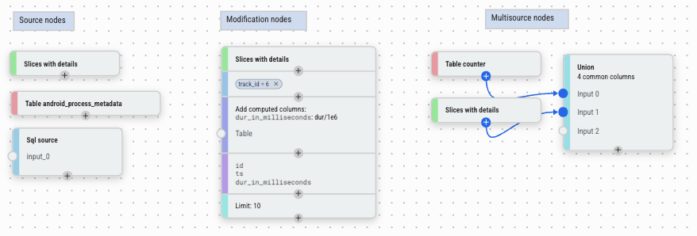

# Data Explorer

Data Explorer 是一个无需编写 SQL 即可交互式探索 Trace 数据的工具。核心思路是将分析视为一个**流水线**：你从一个数据源（表或自定义 SQL）开始，然后通过在可视化画布上连接节点或直接与数据表中的数据交互，在上游串联各种操作——过滤、聚合、JOIN 等。结果在构建过程中实时显示。

它在以下场景中最有用：

- **调查不熟悉的数据**——在编写查询之前浏览表包含哪些列和值
- **调试性能问题**——快速对事件进行切片、过滤和聚合，缩小时间花费的范围
- **迭代分析**——逐步构建查询并在每个阶段检查中间结果
- **可视化结果**——使用 Charts 节点将查询输出绘制为图表和仪表盘，或导出回 Trace 作为 [Debug Track](/docs/analysis/debug-tracks.md)

核心特性包括：

- **无需 SQL**——节点完全抽象了 SQL 概念；例如，添加列不需要了解 JOIN，条件表达式通过表单构建而非手写 SQL
- **专为 Perfetto 定制**——一等支持 Trace 特有操作：交叉时间区间、过滤事件到 Timeline 上选择的时间范围、生成时间范围、将开始/结束事件配对为 Slice
- **感知标准库**——集成 [PerfettoSQL 标准库](/docs/analysis/perfetto-sql-getting-started.md)；选择表源时，Data Explorer 知道哪些表存在以及哪些表实际包含当前加载的 Trace 数据
- **可视化图**——通过在画布上连接节点来组合查询；图结构直接映射到查询结构
- **交互式数据网格**——结果在构建过程中实时更新；你也可以直接从网格创建新节点，无需返回画布——点击列值添加过滤，或基于外键从关联表添加列来丰富结果
- **图表和仪表盘**——将 Charts 节点附加到任何查询以生成图表；多个可视化可以组合成仪表盘
- **需要时可使用完整 SQL 能力**——构建器生成真实的 SQL；你可以随时查看生成的查询，当内置节点不够时切换到 Query 节点
- **持久化状态**——图保存在永久链接中并缓存在浏览器中，因此会话之间不会丢失工作，同一个图可用于你打开的任何 Trace
- **导入 / 导出**——将查询图保存为 JSON 文件或从 JSON 文件加载，便于分享

## 概念

### 项目

Data Explorer 中的工作按**项目**组织。每个项目包含一个查询图和任意数量的仪表盘。你可以维护多个项目以保持不同的分析独立，也可以在一个项目中完成所有工作——由你选择。

### 节点

Data Explorer 的核心概念是**节点**。节点分为以下类别：



- **Source 节点**——提供初始数据。例如：SQL 表、Slice 查询或自定义 SQL 表达式。
- **修改节点**——接收单个输入并对其进行转换。例如：过滤、聚合、排序、添加列。每行从一个上游节点进入，经过修改或过滤后输出。
- **多源节点**——组合两个或更多输入的数据，没有单一的主数据源。例如：JOIN、UNION、区间交叉、创建 Slice。
- **导出节点**——位于流水线末端，在查询图之外产出输出：仪表盘视图、图表、Metric 规范，或用于跨 Trace 分析的 Trace Summary。

### 图

<video width="800" controls>
  <source src="https://storage.googleapis.com/perfetto-misc/de-graph.webm" type="video/webm">
</video>

节点排列在画布上。通过从一个节点的输出端口拖拽到另一个节点的输入端口来连接两个节点。大多数节点有一个**主输入**（垂直流向）；一些接受**辅助输入**（侧端口）用于 JOIN 式操作。数据从左到右（或从上到下）流动：每个节点接收其上游节点的输出，并将自己的输出传递给下游。

要在现有流水线中插入节点，点击你想在其后插入的节点上的 **+** 按钮——新节点会自动连接在该节点与其下游连接之间。你也可以直接从数据网格插入节点而无需返回画布：例如，点击单元格值会内联添加一个该值的过滤节点。

要删除节点，选中它并按 `Delete`（或使用右键菜单）。如果被删除的节点在流水线中间，其主父节点会自动重新连接到其主子节点，使图的其余部分保持完整。

使用按钮撤销和重做更改。

### 列类型

每列都有一个 PerfettoSQL 类型。类型影响值在数据网格中的显示方式、列上可用的操作，以及数据网格在交互时能做什么。

| 类型 | 描述 |
|------|------|
| `int` | 整数值 |
| `double` | 浮点数值 |
| `string` | 文本 |
| `boolean` | 真 / 假 |
| `timestamp` | 以纳秒为单位的绝对时间戳；在数据网格中显示为人类可读时间 |
| `duration` | 以纳秒为单位的持续时间；在数据网格中以可读单位（ms、us 等）显示 |
| `arg_set_id` | 引用一组 Trace 参数；启用 Add Columns 中的 **From args** 功能 |
| `id` | 引用已知表中特定行的整数 ID；在数据网格中显示为指向 Timeline 的链接，并启用外键列丰富 |
| `joinid` | 类似 `id`，但专门用作 JOIN 键 |
| `bytes` | 原始字节序列；实践中很少遇到 |

类型从标准库 Schema 自动推断。对于由 Query 节点或计算表达式生成的列，可能需要通过 Modify Columns 或 Add Columns 中的列类型选择器手动设置类型。

### 结果

选择图中的任何节点即可在画布下方的数据网格中查看其结果。网格支持列排序、过滤和添加新列，并通过查询引擎的分页机制处理大型结果集。列类型用于特殊单元格格式化——持续时间以可读单位显示，ID 直接链接到 Timeline。

## 构建查询

### Smart Graph

最快速的入门方式是 **Smart Graph**，可从导航面板访问。它会检查当前加载的 Trace 并自动生成一个图，其中填充了所有有数据的 Core 和 Very Common 表——让你无需任何手动设置就能概览 Trace 中可用的内容。

在探索时，优先关注 **Very Common** 表——这些是我们推荐的良好分析起点。Core 表是从 Trace Processor 直接收集的未过滤、无偏向的集合，仅为完整性而包含，不作为推荐起点。有关重要性级别的完整说明，请参阅下方节点参考中的 Table 部分。

### 添加 Source 节点

<video width="800" controls>
  <source src="https://storage.googleapis.com/perfetto-misc/de-sources.webm" type="video/webm">
</video>

点击画布左上角的蓝色 **+** 按钮打开节点菜单。在 **Sources** 下，选择数据的起点：

| 节点 | 描述 | 快捷键 |
|------|------|--------|
| [**Table**](#table) | 使用任何标准库表 | `T` |
| [**Slices**](#slices) | 预配置的 Trace 线程 Slice 查询 | `L` |
| [**Query**](#query) | 自定义 SQL 查询；列类型可能需要手动设置 | `Q` |
| [**Time Range**](#time-range) | 时间区间，手动输入或从 Timeline 选择同步 | — |

### 添加节点

<video width="800" controls>
  <source src="https://storage.googleapis.com/perfetto-misc/de-adding-nodes.webm" type="video/webm">
</video>

选中一个节点后，打开节点菜单并选择一个操作。新节点会自动连接到选中的节点。操作分为两类：

**修改节点**转换单个输入：

| 节点 | 描述 |
|------|------|
| [**Filter**](#filter) | 按值、条件、集合成员或时间区间过滤行。 |
| [**Aggregation**](#aggregation) | 分组行并添加聚合列。 |
| [**Sort**](#sort) | 按一列或多列对行排序，升序或降序。 |
| [**Modify Columns**](#modify-columns) | 重命名、移除或更改列类型。 |
| [**Add Columns**](#add-columns) | 从辅助源或计算表达式添加列。 |
| [**Limit / Offset**](#limit-offset) | 限制返回的行数。 |
| [**Filter During**](#filter) | 保留落在辅助源时间区间内的行。 |
| [**Counter to Intervals**](#counter-to-intervals) | 将 Counter 数据（时间戳，无持续时间）转换为带 `ts` 和 `dur` 的区间。 |
| [**Charts**](#charts) | 将数据可视化为条形图或直方图；点击条形可添加过滤。 |

**多源节点**组合多个源的数据，没有单一的主输入：

| 节点 | 描述 |
|------|------|
| [**Join**](#join) | 在共享键上组合两个源的列。 |
| [**Union**](#union) | 将多个源的行堆叠为单个结果。 |
| [**Interval Intersect**](#interval-intersect) | 仅返回两组时间区间重叠的部分。 |
| [**Create Slices**](#create-slices) | 将两个源的开始/结束事件配对为 Slice。 |

**导出节点**在查询流水线之外产出输出：

| 节点 | 描述 |
|------|------|
| [**Dashboard**](#dashboard) | 将数据源导出到仪表盘。 |
| [**Metrics**](#metrics) | 使用值列和维度定义 Trace Metric。 |
| [**Trace Summary**](#trace-summary) | 将多个 Metric 打包为单个 Trace Summary 规范。 |

## 运行查询

大多数节点在构建图时自动执行。需要你编写 SQL 或完成输入配置后才能运行的节点——例如 Query 节点——改为显示 **Run Query** 按钮。节点准备就绪后点击它。

## 查看结果

点击任何节点选中它。其结果显示在 Data Explorer 底部的数据网格中。网格支持：

- **列排序**——点击列标题排序
- **列过滤**——在网格内内联过滤值
- **导出到 Timeline**——使用数据网格工具栏中的 **Export to timeline** 按钮将结果发送回主 Timeline 作为 [Debug Track](/docs/analysis/debug-tracks.md)

要查看选中节点生成的 SQL，点击节点侧边栏中的 **SQL** 标签。**Proto** 标签显示节点的内部查询表示为结构化 Proto——用于调试或以编程方式共享查询图。

## 导入 / 导出

使用 **Export** 按钮将当前图保存为 JSON 文件。使用 **Import** 重新加载之前保存的图。这在与团队成员共享查询流水线或跨会话保存工作时很有用。

## 示例

点击 Data Explorer 工具栏中的 **Examples** 加载一组精选的预构建查询图。这些涵盖了常见的分析模式——查找长 Slice、按进程聚合 CPU 时间、按时间窗口过滤事件、JOIN 线程元数据和构建仪表盘——是构建自己查询的良好起点。

## 节点参考

### Source {#sources}

#### Table {#table}

加载 [PerfettoSQL 标准库](/docs/analysis/perfetto-sql-getting-started.md)中的任何表。选择表时，Data Explorer 显示哪些表存在，并高亮那些包含当前加载 Trace 数据的表。

表标记有重要性级别，表示其广泛有用的程度：

| 级别 | 标签 | 含义 |
|------|------|------|
| `core` | Core | 从 Trace Processor 直接收集的未过滤、无偏向的表集合——仅为完整性而包含，不推荐作为起点 |
| `high` | Very common | 推荐作为良好分析起点的表 |
| `mid` | *（无标签）* | 常见表，显示时无标签 |
| `low` | Deprecated | 已弃用且可能被移除的表 |

Smart Graph 自动添加所有包含已加载 Trace 数据的 Core 和 Very Common 表。从 Very Common 表开始你的探索。

NOTE: "有数据"指示器是尽力而为的。并非所有标记为有数据的表都一定包含行——把它当作提示而非保证。

#### Slices {#slices}

一个预配置的 Source，覆盖 Trace 中所有线程 Slice，已关联线程和进程元数据——暴露 `ts`、`dur`、`name`、`tid`、`pid`、`thread_name` 和 `process_name` 等列，无需手动 JOIN。等效于查询带有线程和进程上下文的 `slice` 表。是探索存在哪些事件的良好起点，无需知道要 JOIN 哪些表。

#### Query {#query}

自由格式 SQL 编辑器。当内置 Source 节点不够用时使用。

Query 节点只接受一个 `SELECT` 语句。你还可以在之前包含 `INCLUDE PERFETTO MODULE` 语句来引入标准库模块。不允许其他语句——不允许 `CREATE`、不允许 `INSERT`、不允许多个 `SELECT`。

如果你将其他节点连接到此节点的输入端口，你可以在查询中引用它们为 `$input_0`、`$input_1` 等——例如在 `SELECT` 中使用 `FROM $input_0`。这让你在任何上游节点的输出之上组合自由格式 SQL。

列类型永远不会从任意 SQL 推断——如果你希望列具有正确的类型（用于链接渲染、持续时间格式化、外键丰富等），你必须使用下游的 [Modify Columns](#modify-columns) 节点手动设置。

#### Time Range {#time-range}

一个时间区间，用作数据源。区间可以手动输入或从当前 Timeline 选择同步——后者会在选择更改时动态更新。作为 [Filter During](#filter-during) 或 [Interval Intersect](#interval-intersect) 的输入很有用。

---

### 修改节点 {#modification-nodes}

#### Filter {#filter}

有三种 Filter 系列节点，每种覆盖不同类型的过滤。三者都减少结果中的行数，而不更改列。

<?tabs>

TAB: Filter（标准）

基于条件过滤行。大多数情况下你不需要手动创建 Filter 节点——直接从要过滤的节点的结果中添加过滤要快得多：

- **点击单元格值**——添加对该值的等于或不等于过滤。
- **点击列标题**——打开选择器选择要过滤的值。

当你确实需要手动创建 Filter 节点时，它支持两种模式：

- **结构化**——通过 UI 选择列、运算符和值。可用运算符：`=`、`!=`、`<`、`>`、`<=`、`>=`、`glob`、`is null`、`is not null`。
- **自由格式**——编写原始 SQL `WHERE` 表达式，用于结构化模式无法表达的情况，如多列条件或不符合选择器的子表达式。

多个条件可以用 `AND`（必须全部满足）或 `OR`（满足任一即可）组合——在节点级别切换。由于 AND/OR 模式应用于整个节点，复杂的表达式如 `(X OR Y) AND Z` 通过串联两个 Filter 节点实现：一个用 OR 处理 `X OR Y` 部分，一个用 AND 处理 `Z` 部分。

TAB: Filter In（行）

仅保留列值出现在辅助节点输出中的行。等效于 SQL `WHERE col IN (SELECT ...)`。

从主输入中选择基础列，从辅助输入中选择匹配列——当基础列值在匹配列中找到时，保留该行。如果两个输入之间只有一个公共列，则会自动建议。

适用于将 Slice 过滤为仅属于特定线程集的 Slice，或按一组 Track ID 过滤 Counter。

TAB: Filter During（时间）

仅保留时间区间与辅助源的区间重叠的行。专为 Trace 特有的时间过滤设计——例如，仅保留在特定任务、Frame 或 Trace 阶段期间发生的事件。

关键选项：

- **裁剪到区间**（默认开启）——输出的 `ts` 和 `dur` 被裁剪为与过滤区间的交集。关闭此选项以保留主行的原始 `ts` 和 `dur`。
- **按...分组**——按一列或多列（例如按线程或进程）对重叠计算分组，这样过滤区间仅与同一组中的主行匹配。

重叠的过滤区间会自动合并。如果主行跨越多个不重叠的过滤区间，它会为每个区间复制一次。

</tabs?>

#### Aggregation {#aggregation}

按一列或多列对行分组并计算聚合值。等效于 SQL `GROUP BY`。如果未选择分组列，整个结果聚合为单行。

可用的聚合函数：

| 函数 | 描述 |
|------|------|
| `COUNT` | 列中非空值的计数 |
| `COUNT(*)` | 所有行的计数 |
| `COUNT_DISTINCT` | 唯一非空值的计数 |
| `SUM` | 值的总和 |
| `MIN` | 最小值 |
| `MAX` | 最大值 |
| `MEAN` | 算术平均值 |
| `MEDIAN` | 中位数 |
| `DURATION_WEIGHTED_MEAN` | 以 `dur` 列加权的平均值 |
| `PERCENTILE` | 百分位值；需要指定百分位数（0-100） |

可以在单个节点中添加多个聚合，每个产生一个命名的输出列。

#### Sort {#sort}

按一列或多列对行排序，每列独立升序或降序。列可以通过拖拽重新排序来控制优先级。等效于 SQL `ORDER BY`。

#### Modify Columns {#modify-columns}

控制哪些列传递到下游及其显示方式：

- **显示 / 隐藏**——取消勾选以从输出中移除列
- **重命名**——为任何列指定别名
- **更改类型**——覆盖推断的列类型
- **重新排序**——拖拽列到不同顺序

适用于在进一步处理或可视化之前清理中间结果。

#### Add Columns {#add-columns}

这个节点的思维模型很简单：从上游节点获取所有内容，然后添加一个或多个新列。每行原样传递——节点只会扩展结果。当你看着结果心想"我希望这里还多一列 X"时，就用它。

因为"X"可以有很多含义——来自另一个表的值、计算表达式、从原始 ID 派生的标签、Trace 参数——该节点支持六种不同的方式来生成新列：

<?tabs>

TAB: 从另一个源 JOIN

当你想要的列位于不同的表中时使用。选择一个辅助节点，选择要引入的列，并指定 JOIN 键。JOIN 自动执行，无需编写 SQL。

JOIN 键有两种解析方式：

- 如果上游数据已经包含一个类型化为已知表的 `joinid` 列（例如类型化为 `thread` 的 `thread_id`），Data Explorer 会自动建议该表并预填 JOIN 键的两侧——你只需确认并选择要引入的列。这是常见情况，通常只需几次点击。
- 如果没有类型化建议，你需要手动从主输入选择一列，从辅助输入选择一列匹配列进行 JOIN。

这是一个**左连接**：上游节点的每一行都被保留，即使在辅助源中找不到匹配行。对于没有匹配的行，新列将是 `NULL`。这意味着添加列永远不会静默丢弃结果中的行——你总是看到完整的上游数据，JOIN 未找到匹配的地方显示空值。

每个引入的列可以内联重命名和覆盖类型。

TAB: 表达式

当你想要的列可以从结果中已有的列计算得出时使用。编写任何有效的 PerfettoSQL 表达式，它会在每行上求值。你能在 SQL `SELECT` 子句中写的任何内容都可以在这里使用。

示例：

- `dur / 1e6`——将纳秒转换为毫秒
- `name || ' (' || tid || ')'`——构建显示标签
- `ts + dur`——计算结束时间戳

TAB: Switch

当你想将现有列的特定值映射到新的输出值时使用——例如，将数字状态码转换为人类可读的标签，或将内部枚举转换为有意义的名称。

选择要进行 Switch 的列，然后列出 case：当列等于此值时，产生该输出。等效于 SQL `CASE col WHEN v1 THEN r1 WHEN v2 THEN r2 END`，但通过表单表达，无需 SQL 知识。

在字符串列上，匹配可以使用 **glob 模式**而非精确相等——所以你可以将 `com.google.*` 映射到 `'Google app'`，将 `com.android.*` 映射到 `'Android app'`，而无需列出每个包名。这也是列类型重要的原因之一：Data Explorer 使用类型来决定是否提供 glob 匹配选项。

TAB: If

当你想要的列取决于条件而非精确值匹配时使用。编写条件、条件为真时的值、可选的 `elif` 分支用于额外情况，以及回退 `else` 值。

适用于对行进行分桶——例如，当 `dur > 1e9` 时产生 `'long'`，否则产生 `'short'`，或按阈值范围标记行。等效于 SQL `CASE WHEN cond THEN val ... ELSE fallback END`，但通过结构化表单表达。

TAB: From args

当你想要的列存储为 `arg_set_id` 列上的 Trace 参数时使用，这是 Perfetto Trace 中非常常见的模式。

Data Explorer 不需要手动编写 args JOIN，而是检查当前结果集，发现数据中实际存在哪些 arg 键，并将它们呈现为可搜索列表。选择一个键，新列就会出现，通过 `extract_arg(arg_set_id_col, key)` 填充，列名从键自动派生。

这使得呈现任意每事件元数据——渲染意图、调度参数、应用特定注解——只需几次点击，无需了解 args 表 Schema。

TAB: Apply function

当你想要的列是 PerfettoSQL 标准库函数应用于当前行的返回值时使用。

两步流程：首先搜索并从标准库中选择一个函数；然后配置参数绑定，将每个函数参数映射到源列或自定义表达式。适用于在你的数据上调用辅助宏或任何标准库函数，而无需切换到 Query 节点。

</tabs?>

多种类型的多个列可以在单个节点中添加，每种独立配置。如果自动推断不正确，每列的类型可以内联覆盖。

#### Limit / Offset {#limit-offset}

限制返回的行数，并可选地跳过开头的若干行。等效于 SQL `LIMIT` / `OFFSET`。默认 limit=10，offset=0。适用于采样大型结果或分页浏览数据。

#### Counter to Intervals {#counter-to-intervals}

将 Counter 数据——有时间戳但无持续时间——转换为区间，将每个采样与下一个配对，产生 `ts`、`dur`、`next_value` 和 `delta_value` 列。输入必须有 `id`、`ts`、`track_id` 和 `value` 列，且不能已有 `dur` 列。

这是将 Counter 数据与基于区间的节点（如 [Interval Intersect](#interval-intersect) 或 [Filter During](#filter-during)）配合使用的必要前提。

#### Charts {#charts}

将一个或多个可视化附加到上游数据。支持的图表类型：bar、histogram、line、scatter、pie、treemap、boxplot、heatmap、CDF、scorecard。

每个图表独立配置，有自己的列、聚合和显示选项。过滤器可以按图表应用或在节点中的所有图表间共享。点击图表中的条形或数据点会自动向流水线反馈一个过滤条件。

---

### 多源节点 {#multi-source-nodes}

#### Join {#join}

通过在共享键上匹配行来组合两个源的列。左输入提供基础行；右输入提供要引入的列。

两种 JOIN 类型可用：

- **Inner join**（默认）——只保留两侧匹配的行。左输入中在右输入没有匹配的行被丢弃。
- **Left join**——保留左输入的所有行。右输入没有匹配的行，右侧列为 `NULL`。

JOIN 条件可以用两种模式配置：

- **相等**——从左输入选一列，从右输入选一列；当这些列相等时匹配行。这覆盖了常见情况。
- **自由格式**——编写自定义 SQL 表达式，用于相等模式无法表达的情况，如范围条件或多列键。

你可以选择每侧哪些列出现在输出中，并用别名重命名。

NOTE: 如果只是用关联表的列丰富结果，[Add Columns](#add-columns) 的"从另一个源 JOIN"通常更方便——它会自动处理键建议，默认是左连接。当你需要内连接或自由格式条件时，使用此 Join 节点。

#### Union {#union}

将两个或多个源的行堆叠为单个结果。接受任意数量的输入（无上限）。

你选择哪些列出现在输出中。你可以包含并非每个源都有的列——在一个或多个源中缺失的列会从输出中静默排除，而不会导致错误。如果各源之间列名不一致，可在上游使用 [Modify Columns](#modify-columns) 重命名列。

NOTE: 这比 SQL `UNION` / `UNION ALL` 更宽松，后者要求所有输入具有相同的列。在这里，你可以自由添加具有不同 Schema 的源——并非在所有源中都出现的列就不会出现在结果中。

#### Interval Intersect {#interval-intersect}

接收两到六个时间区间源，仅返回它们同时重叠的部分。每个输入必须有 `id`、`ts` 和 `dur` 列。如果你的数据有时间戳但无持续时间，请在上游使用 [Counter to Intervals](#counter-to-intervals)。

关键选项：

- **按...分组**——将交集限制为在一列或多列中共享相同值的行。例如，按 `utid` 分组意味着区间仅与同一线程上的其他区间进行交叉——线程 A 上的 CPU 运行区间不会与线程 B 上的 Frame 区间交叉。
- **ts/dur 来源**——控制输出中的 `id`、`ts` 和 `dur` 来自哪里。设置为"intersection"使用裁剪后的区间边界，无 `id`；设置为特定输入时，携带该输入的原始 `id`、`ts` 和 `dur` 以及裁剪后的边界。

#### Create Slices {#create-slices}

接收两个事件源——一个用于开始事件，一个用于结束事件——将它们配对成带 `ts` 和 `dur` 的 Slice。适用于从原始开始/结束 Log 行或 Counter 转换构建合成 Slice，其中开始和结束分别记录。

每个输入可以用两种模式之一配置：

- **ts**——输入提供标记每个事件开始（或结束）的单个时间戳列。
- **ts + dur**——输入提供时间戳和持续时间；区间末端计算为 `ts + dur`。当一侧已有持续时间信息时很有用。

时间戳列的类型必须为 `timestamp`，持续时间列的类型必须为 `duration`——如果源只有一个所需类型的列，它会自动选中。输出恰好包含两列：`ts` 和 `dur`。

---

### 导出节点 {#export-nodes}

#### Dashboard {#dashboard}

将上游查询结果作为命名数据源在仪表盘视图中可用。Dashboard 节点本身是直通的——它不转换数据，只是将结果注册到名称下以便与其他源一起显示。

多个不同流水线的 Dashboard 节点可以同时激活，它们都在仪表盘视图中并排显示。这让你可以组合多面板概览——例如，顶部 CPU 消耗者表旁边是按进程的细分——每个面板由自己独立的查询流水线支撑。数据保持实时：修改上游图时，仪表盘自动更新。

你可以为每个 Dashboard 节点指定导出名称以控制它在仪表盘中的显示方式。如果未设置名称，则使用上游节点的标题。

#### Metrics {#metrics}

将上游查询结果转为结构化 Trace Metric，用于导出和跨 Trace 分析。该节点不会更改结果中的数据——它用 [Trace Summary](/docs/analysis/trace-summary.md) 基础设施所需的 Schema 来注解数据。

配置：

- **Metric ID 前缀**——此 Metric 族的短标识符（例如 `memory_per_process`）。用作导出规范中的基础名称，且必须在同一 Trace Summary 的所有 Metrics 节点中唯一。
- **维度**——标识行描述内容的列：Metric 的分类轴（例如 `process_name`、`thread_name`）。任何非数值列都可用作维度。
- **值列**——实际度量值的数值列。每个值列配置有：
  - **单位**——度量的单位（例如字节、毫秒、百分比），从标准列表选择或作为自定义字符串输入。
  - **极性**——较高或较低值哪个更好，或不适用。用于分析工具标记回归。
  - **显示名称 / 帮助文本**——可选标签，用于人类可读输出。
- **维度唯一性**——每个维度值组合是精确出现一次（`UNIQUE`）还是可能出现多次（`NOT_UNIQUE`）。正确设置此值可在下游工具中实现更精确的聚合。

该节点显示计算出的 Metric 数据的实时预览。如果你只有一个 Metric，也可以直接从节点导出 `.pbtxt` textproto 文件作为 Metric 规范，而无需 Trace Summary 节点。

将此节点连接到 [Trace Summary](#trace-summary) 节点以将其与其他 Metric 组合进行联合导出。

#### Trace Summary {#trace-summary}

将一个或多个 [Metrics](#metrics) 节点打包为单个 [Trace Summary](/docs/analysis/trace-summary.md) 规范。这是产出可在 UI 外针对任何 Trace 运行的可复用、可移植 Metric 规范的最后一步。

将任意数量的 Metrics 节点连接到 Trace Summary 节点的输入端口——每个端口对应一个 Metric。Metric ID 前缀在所有连接的节点中必须唯一。结果在节点的面板中显示，每个 Metric 一个标签页。

点击 **Export** 下载 `trace_summary_spec.pbtxt` 文件。然后该文件可使用 Trace Processor CLI 或 Python API 对任何 Trace 运行：

<?tabs>

TAB: 命令行

```sh
trace_processor_shell summarize --metrics-v2 IDS \
  trace.pftrace spec.pbtxt
```

TAB: Python API

```python
tp.trace_summary(specs, metric_ids, metadata_query_id)
```

</tabs?>

完整文档请参阅 [Trace Summarization](/docs/analysis/trace-summary.md)，了解如何在下游使用导出的规范。
