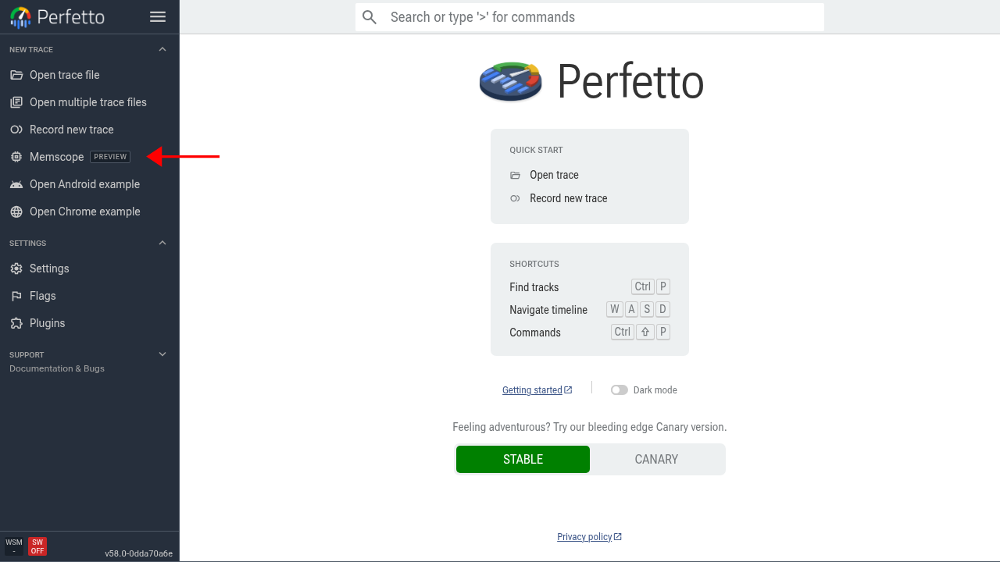
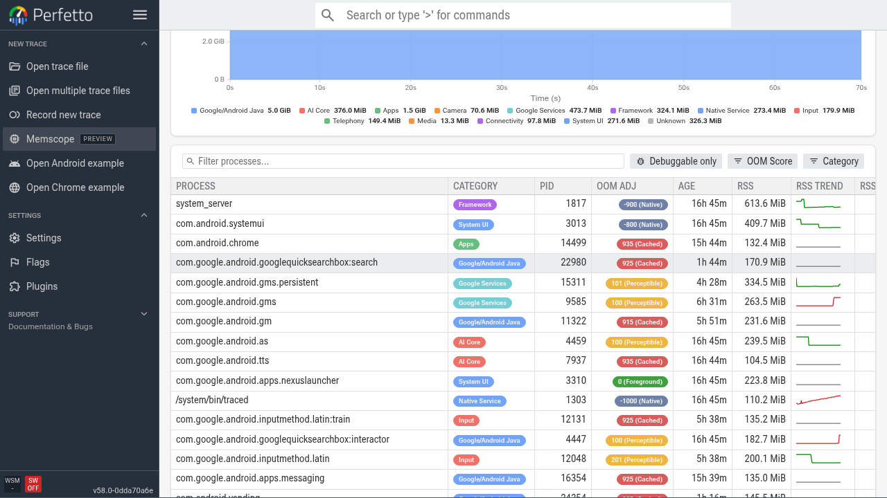
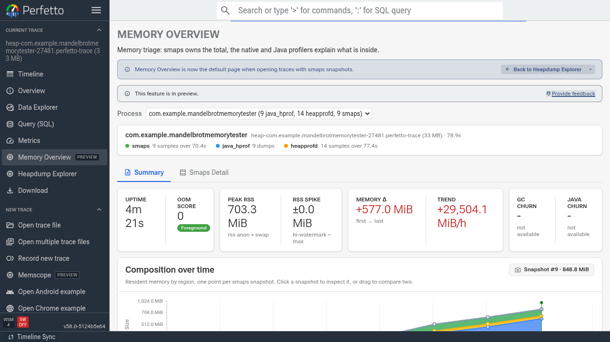
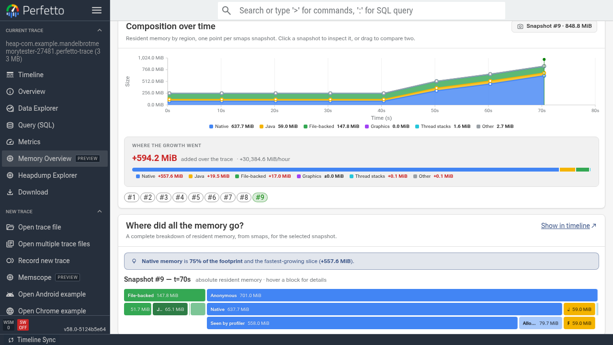
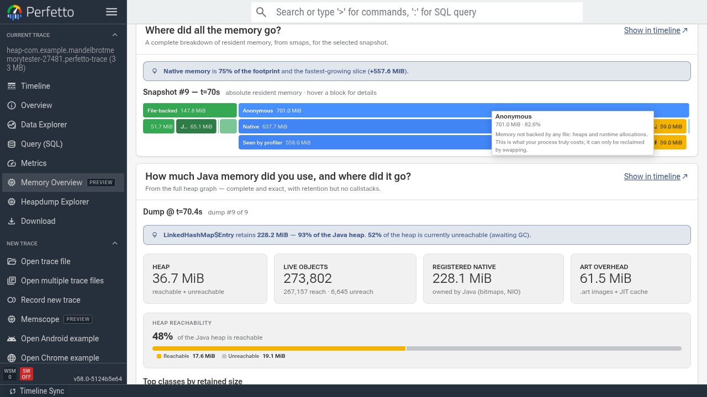
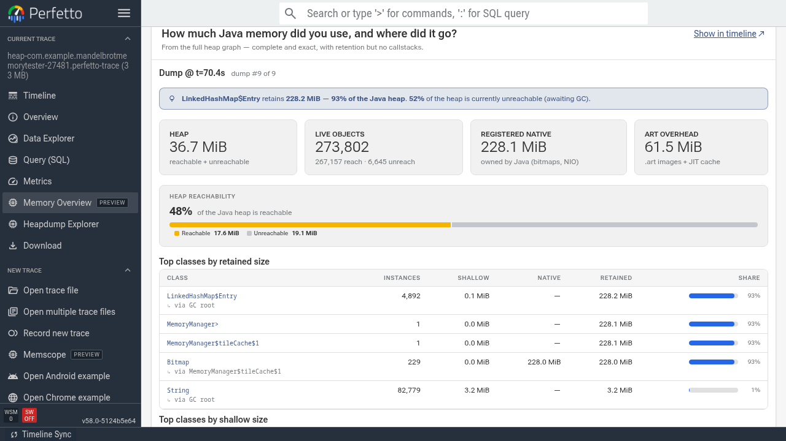
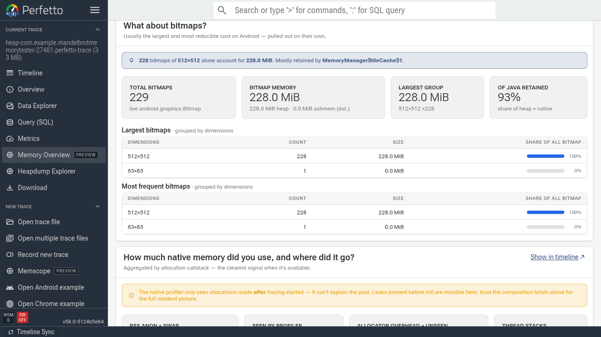
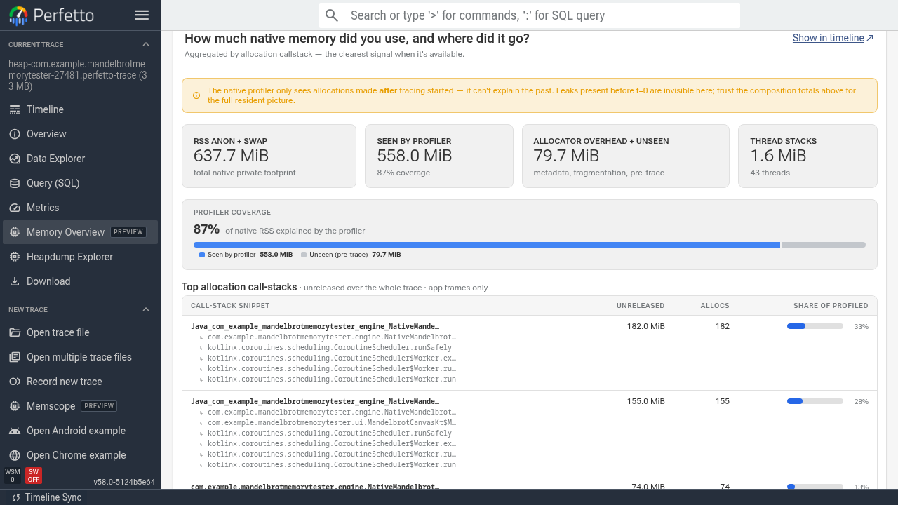
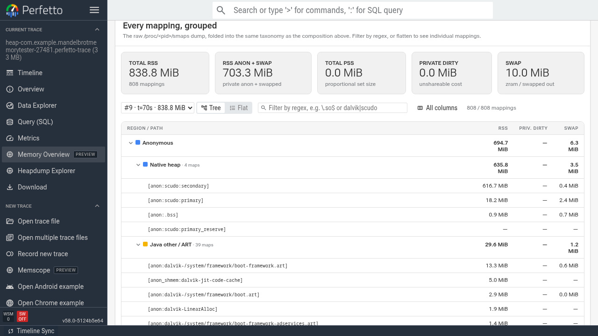

# Memscope 与 Memory Overview

NOTE: Memscope 和 Memory Overview 目前在 Autopush 和 Canary 渠道可用。可以使用[发布渠道标志](https://ui.perfetto.dev/#!/flags/releaseChannel)切换渠道。

Perfetto 为内存分析提供了两个互补的功能：

- **Memscope** - 一个实时内存监视器，展示运行中设备的系统级和逐进程统计信息，并提供快捷方式来开始对特定进程进行 trace。
- **Memory Overview** - 在录制 trace 后出现，提供内存信息的高层次概览，融合了 smaps 快照、ART heap dump 和 native profiling，并提供链接以便使用 [Heap Dump 浏览器](/docs/visualization/heap-dump-explorer.md)和时间线上的现有内存 track 进一步深入分析。

本指南介绍如何使用 Memscope 录制 trace，并在 Memory Overview 页面中进行分析。

NOTE: 录制 smaps 快照需要 Android build `ZP1A.260626.001` 或更高版本。

## Memscope：实时内存监控

Memscope 可以连接到 Android 设备或 Linux 主机，实时查看系统和逐进程内存指标的变化。它适用于：

- 检查系统的整体健康状况（内存压力 / 抖动 / LMK）。
- 找出随时间不断增长的进程。
- 在执行特定操作前后抽查内存使用情况。
- 针对特定进程启动 trace。

### 启动实时 Memscope 会话

1. 打开 https://ui.perfetto.dev 并点击侧边栏中的 **Memscope**。

   

2. 使用可用的传输方式之一连接到你的设备或主机。录制选项与 record 页面上的完全相同。如果不确定选哪个，对于通过 USB 连接的 Android 设备，WebUSB 是最简单的选择。

3. 连接后，Memscope 会显示一个系统统计仪表盘，以及一个任务管理器风格的运行中进程列表及其内存统计信息。仪表盘每隔几秒更新一次。

   

   

   你可以点击页面顶部的各个标签页，查看各种系统级内存统计，例如 page cache 使用情况和内存压力。

### 进程监控

使用进程表格可以：

- **按内存使用排序** - 默认情况下，进程列表按 RSS Anon + Swap 用量降序排序。
- **观察趋势** - 每个进程旁边的 sparkline 显示近期 RSS 的走向 - 持续呈上升趋势的进程值得进一步深入调查。
- **搜索进程** - 使用过滤框按名称搜索特定的进程或包。
- **对进程进行 profile** - 将鼠标悬停在进程行上会显示 **Profile** 按钮 - 点击它即可为该进程启动 heap profile。

  

  在这个例子中，我们要测试一个有意泄漏 native 内存的示例应用。

### 录制并打开 trace

点击 **Profile** 后，Memscope 会使用预配置的内存 trace 配置开始录制所选进程。

这个预配置的 trace 配置包括：

- 周期性的 [Java (ART) heap dump](/docs/data-sources/java-heap-profiler.md)（每 10 秒）。
- 周期性的 smaps dump（每 10 秒）。
- [Native heap profiling](/docs/data-sources/native-heap-profiler.md)（每 5 秒 dump 一次）。

操作应用或以其他方式复现你想要调查的行为，然后点击 **Stop & Open Trace**。你可以使用此页面上的堆叠面积图监控高层次内存使用情况。

## Memory Overview：事后内存排查

对于任何包含 smaps 快照的 trace，Memory Overview 页面会默认打开；你也可以在侧边栏的 **Memory Overview** 下找到它。它提供了给定进程在 trace 时长范围内内存使用情况的全面视图。

NOTE: 对于 Googler，你可以通过
[process_smaps 仪表盘](https://apconsole.corp.google.com/dashboards/process_smaps)
找到包含 smaps dump 的好 trace 示例。不过这些通常只包含单次 dump，因此此页面上的时间线视图会被隐藏。

### 进程选择器和核心统计

在页面顶部，进程选择器让你选择要检查的进程。默认情况下，选中拥有最多内存相关统计信息的进程。如果你是通过 Memscope 录制的 trace，该进程会被自动选中，因为它只录制单个进程。

### 组成图表

组成随时间变化的图表基于 smaps 快照中的信息，展示内存如何按类别（anon、file、shmem 等）划分。它用于为页面的其余部分提供顶层的时间导航。你可以：

- **选择单个快照** - 点击图表上的数据点来检查特定快照。后续各小节将仅展示该快照的细分情况。
- **跨范围拖动** - 点击并拖动跨越多个快照，可以对比快照并查看内存使用随时间的变化。

在这个例子中，我们可以看到 native 内存在 trace 接近结束时（在我们开始与应用交互之后）开始快速增长。

#### 增长去了哪里

这个条形图展示了所选范围内内存增长如何拆分到各个高层类别。如果选择的是单个快照，则显示相对于 trace 起点的增量。

### 内存细分小节

在图表下方，Memory Overview 提供了若干小节用于深入分析内存使用情况。

#### 内存都去了哪里？

这一小节基于所选快照的 smaps 数据展示常驻内存的细分情况（绝对值，而非增量）。可以用它来判断下面哪些小节占用了最多的内存。

在这个例子中，我们可以看到 native 内存占了很大比例。

#### Java 堆

对于 ART 进程，Java 小节解释了堆的使用情况，并按类名分组列出按各种指标衡量最重的 retained 对象。点击任意类名即可在 Heap Dump 浏览器中查看相关的对象。

#### Bitmap

bitmap 小节按尺寸分组，汇总最大和最频繁出现的 bitmap。

#### Native 分配

native 分配小节展示未释放的内存分配调用点（即尚未观察到后续 free 的分配）中排在前面的那些。请注意，它无法涵盖所有 native 内存使用 - 只涵盖自开始录制 trace 以来的分配。在我们的示例中它覆盖了 87%，因此我们可以很好地了解内存的去向。

我们可以看到 mandelbrot 引擎中的一个 native 函数分配了 182 MB 而没有释放。这个函数来自示例应用中的一个 native 图块渲染库，该库用于生成 mandelbrot bitmap 并将其送回 Java 运行时进行合成。它本不应保留多少内存（如果有的话）。这个有意制造的泄漏实际上是因为跳过了对已渲染图块的图像缓冲区的 free 调用，因此每次调用该 native 代码都会泄漏一个 512x512px 的缓冲区，并随时间不断累积。

点击 'Show in timeline' 按钮可以更详细地深入查看 native 分配火焰图。

#### Smaps Detail

滚动回到页面顶部，点击 Memory Overview 顶部的 **Smaps Detail** 标签页，查看原始的 `/proc/<pid>/smaps` 数据。表格使用与组成图表相同的类别对内存映射进行分组。

## 串起整个流程：一个工作流

总结一下，典型的内存调查工作流如下：

1. **找到进程** - 使用 Memscope 实时监控内存，识别哪个进程在增长，或找到你想要监控的进程。
2. **开始对该进程进行 trace** - 点击开始对问题进程进行 profiling，然后在 UI 中打开 trace。
3. **在 Memory Overview 中排查** - 打开 trace，使用组成图表和各细分小节了解内存的去向。
4. **进一步深入** - 如有需要，从 Memscope 启动 native heap profile，或录制一个启用了 heap profiling 的新 trace 以获取分配调用堆栈。

## 另请参阅

- [Memory Profiling 指南](/docs/getting-started/memory-profiling.md) - native heap profiling、ART heap dump 和分配 profiling 的概述。
- [内存 Counter](/docs/data-sources/memory-counters.md) - 来自内核的逐进程内存计数器和事件。
- [Native heap profiler](/docs/data-sources/native-heap-profiler.md) - 深入了解 heapprofd 分配 profiling。
- [Heap Dump 浏览器](/docs/visualization/heap-dump-explorer.md) - 逐对象分析 ART heap dump。
- [内存使用案例研究](/docs/case-studies/memory.md) - 在 Android 上调试内存问题的端到端指南。
